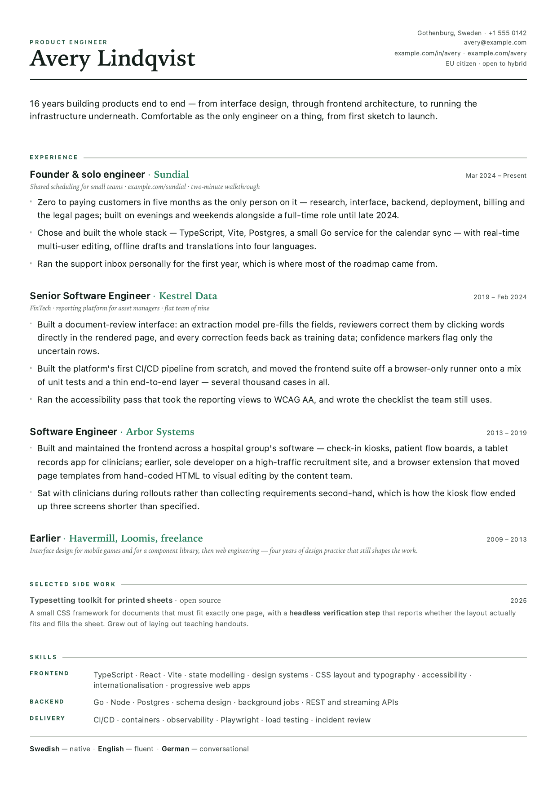
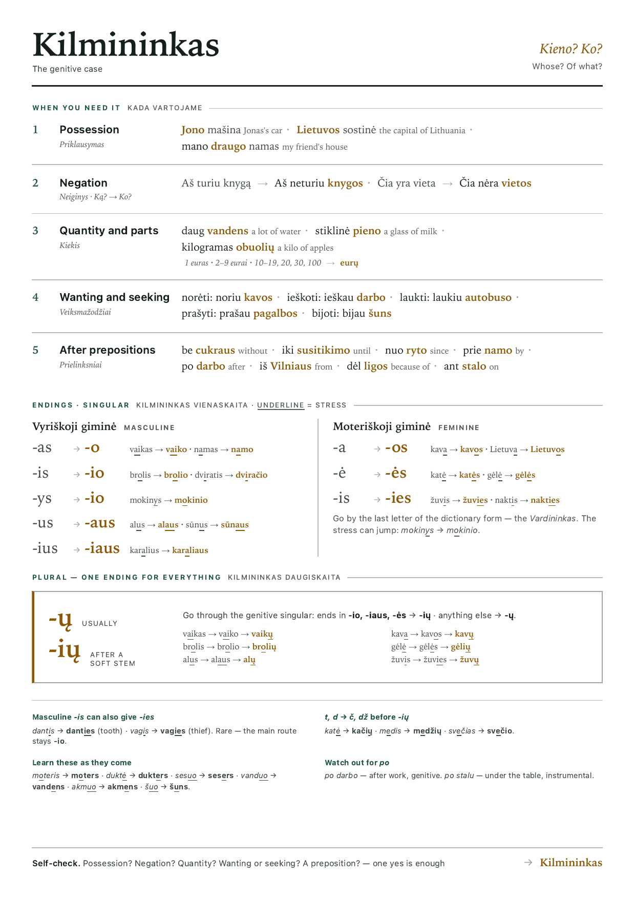
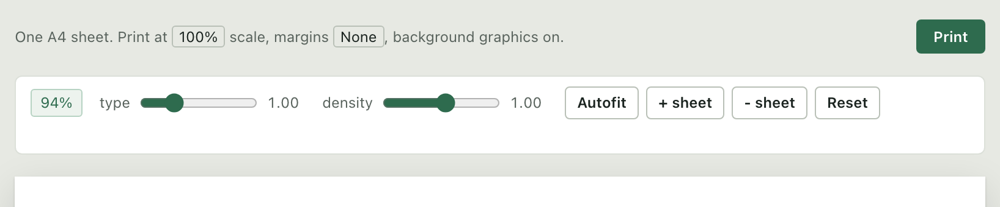
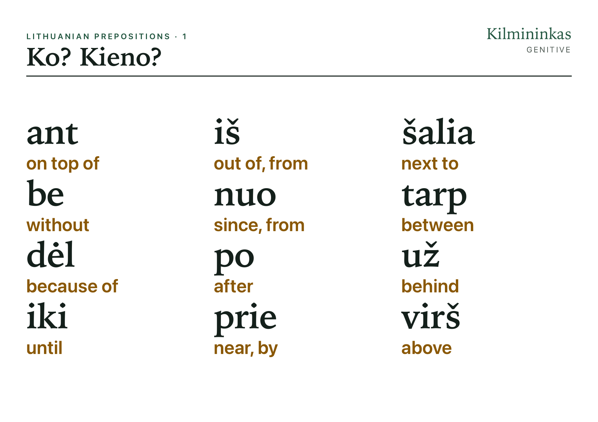
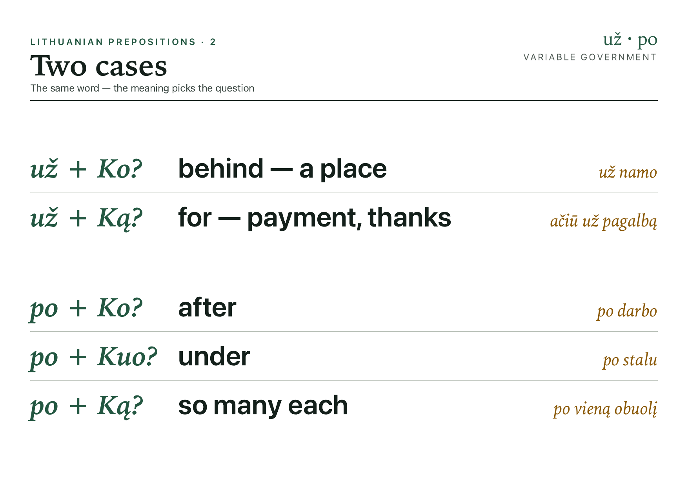

# A4print

Print-ready documents that look the same on screen and on paper.

Give Claude a topic and get back a finished sheet — a cheat sheet, a CV, a one-pager, a
programme, a certificate — laid out to fill exactly one page, ready to print or export to
PDF. Nothing drifts onto a second page, and nothing ends up half empty.

<table>
<tr>
<td width="50%"></td>
<td width="50%"></td>
</tr>
</table>

<sub>Both examples, rendered as they print. Left: `examples/cv.html`. Right: `examples/cheatsheet.html`.</sub>

Built for **one designed sheet at a time**. For long documents that should paginate
themselves — reports, books, manuals — use [Paged.js](https://pagedjs.org/) or
[Vivliostyle](https://vivliostyle.org/) instead.

## Install

As a Claude Code skill:

```bash
git clone https://github.com/stass-1/A4print ~/.claude/skills/a4print
```

Claude will pick it up automatically whenever you ask for something printable.

To use it by hand instead, clone it anywhere and copy an example:

```bash
git clone https://github.com/stass-1/A4print
cp A4print/examples/cv.html my-sheet.html
```

Optional: install [poppler](https://poppler.freedesktop.org/) (`brew install poppler`) so
the checker can also spot widowed lines.

## Use it

Just ask. The skill handles the layout and verifies the result — that it fits the page,
fills it, and has none of the dozen defects that only show up once it is printed.

> Make me an A4 cheat sheet on German separable verbs — the rule, the common prefixes,
> and a dozen examples with the verb in both positions.

> Turn `notes.md` into a one-page handout my students can keep next to them during the
> exercise.

> Build my CV from `career.md` as a single A4 sheet. Aim it at product engineering roles
> at small companies.

> Take this cheat sheet and make a Letter-size version for a US printer.

> The bottom third of the sheet is empty. Fill it out — don't just stretch what's there.

> There's too much text now. Fit it, and tell me if it stops being readable in print.

Then print it: **Chrome → Print → scale 100%, margins None, background graphics on.** Or
let Claude export the PDF for you, which avoids getting those three settings wrong.

## Check that it fits

Every sheet can be verified without opening a browser:

```
$ ./bin/fit-check.sh examples/cv.html

  cv.html
  sheets    1
  pages     1
  fill      0.985
  verdict   ok
  widows    none
  findings  0
  pdf       examples/.fitcheck/check.pdf

  OK    fits, fills the sheet, and nothing else measured wrong.
```

- **pages must equal sheets** — otherwise something spilled over.
- **fill** is how much of the page the content uses. Below 0.90 the sheet looks
  unfinished; above 1.00 it overflowed.
- **findings** is everything else, measured rather than eyeballed — ink outside the
  margin, blocks overlapping, a hole in the middle, a heading sitting closer to the next
  entry than to its own bullets, a colour the theme never defined. Each one names the
  element and the millimetres, and anything marked FAIL makes the check exit non-zero.
- **pdf** is the actual printed page, for you to look at.

On screen there's a panel next to the Print button doing the same thing live: fill
percentage, the same list of findings, sliders for type size and density, an autofit
button, and add/remove sheet.




Autofit will not shrink the type below 90%. Past that, small print stops surviving a
black-and-white laser printer — so it stops and tells you to cut text or add a sheet
instead.

## Adjusting a sheet by hand

Two knobs, in your document's `<style>`:

```css
@layer doc {
  .sheet {
    --t-scale: 0.95;   /* type size, everything at once */
    --rhythm:  0.92;   /* how tight the vertical spacing is */
  }
}
```

Everything else — colours, fonts, components — is documented in
[SKILL.md](SKILL.md), which is also what Claude reads.

Themes: `resume` (quiet, single colour) and `editorial` (green and amber, for teaching
material). Formats: A4, Letter, A5, A3, A4 landscape.

## Something to hang on a wall

Ask for a sheet to be read from across the room and you get `css/mode/wall.css`: a term
and its meaning, set eight times larger than desk type, on A4 landscape.

The catch is that a wall sheet is a budget, not a bigger version of a desk sheet. Where
the desk sheet holds thirty entries, the wall holds eight — so most of the content has to
go, and what remains is split across several sheets that tile into a poster.

<table>
<tr>
<td width="50%"></td>
<td width="50%"></td>
</tr>
</table>

<sub>`examples/wall.html`, both sheets. Together they tile into one poster.</sub>

Say how far away you'll read it — `--wall-distance` in metres — and the check answers
with what the type actually achieves. Ask these two sheets for three metres and it says
they don't get there:

```
  reach     3.0,2.1 m  (cap height per sheet, at 4mm per metre)

  WARN  legibility   sheet 2
                     the smallest term is 8.3mm of cap height, which carries 2.1m
                     — short of the 3m declared in --wall-distance. Cut terms until
                     the rest can be set larger, or split the sheet
```

Nobody can judge that from the markup, which is the reason it is measured. Cap height —
not font size — is what the eye resolves at distance, and 4mm of it buys a metre.

## Examples

`examples/cv.html` — a one-page CV. `examples/cheatsheet.html` — a Lithuanian grammar
cheat sheet. `examples/wall.html` — the same grammar as a pair of wall sheets. Between
them they use every component in the library. The CV's person,
employers and projects are invented; it's there to show the layout at a realistic text
density.

Every picture above is a render of one of those examples, so none of them can drift away
from what the repository actually produces:

```
$ ./bin/docs-shots.sh --check     # have the examples changed since?
$ ./bin/docs-shots.sh             # redraw docs/*.png from them
```

The sheets come out of the print PDF at 150dpi — the printed artefact, not a photo of a
browser. Needs Chrome and poppler.

## Licence

MIT — see [LICENSE](LICENSE).
